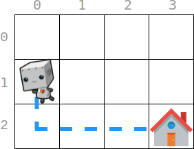

# Leetcode / 2087. Minimum Cost Homecoming of a Robot in a Grid (medium) using C++

[https://leetcode.com/problems/minimum-cost-homecoming-of-a-robot-in-a-grid/](https://leetcode.com/problems/minimum-cost-homecoming-of-a-robot-in-a-grid/)

There is an `m x n` grid, where `(0, 0)` is the top-left cell and `(m - 1, n - 1)` is the bottom-right cell. You are given an integer array startPos where `startPos = [startrow, startcol]` indicates that initially, a robot is at the cell `(startrow, startcol)`. You are also given an integer array homePos where `homePos = [homerow, homecol]` indicates that its home is at the cell `(homerow, homecol)`.

The robot needs to go to its home. It can move one cell in four directions: left, right, up, or down, and it can not move outside the boundary. Every move incurs some cost. You are further given two 0-indexed integer arrays: rowCosts of length m and colCosts of length n.

- If the robot moves up or down into a cell whose row is r, then this move costs `rowCosts[r]`.
- If the robot moves left or right into a cell whose column is c, then this move costs `colCosts[c]`.

Return the minimum total cost for this robot to return home.



```
Input: startPos = [1, 0], homePos = [2, 3], rowCosts = [5, 4, 3], colCosts = [8, 2, 6, 7]
Output: 18
Explanation: One optimal path is that:
Starting from (1, 0)
-> It goes down to (2, 0). This move costs rowCosts[2] = 3.
-> It goes right to (2, 1). This move costs colCosts[1] = 2.
-> It goes right to (2, 2). This move costs colCosts[2] = 6.
-> It goes right to (2, 3). This move costs colCosts[3] = 7.
The total cost is 3 + 2 + 6 + 7 = 18
```

Constraints:

- `m == rowCosts.length`
- `n == colCosts.length`
- `1 <= m, n <= 105`
- `0 <= rowCosts[r], colCosts[c] <= 10^4`
- `startPos.length == 2`
- `homePos.length == 2`
- `0 <= startrow, homerow < m`
- `0 <= startcol, homecol < n`
